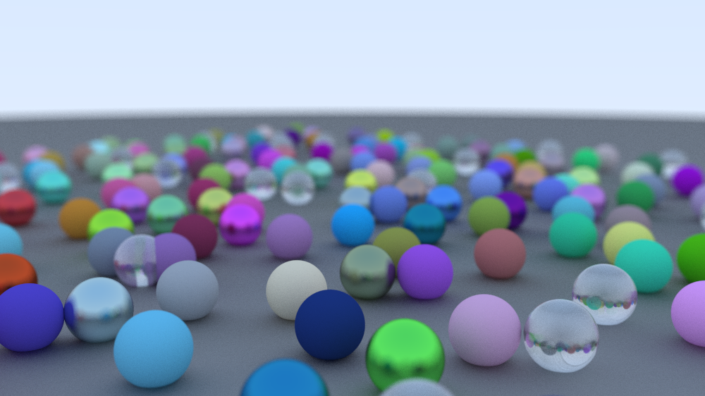

# Raybow

A simple, small personal ray-tracing renderer, based on the [*Ray Tracing in One Weekend* by Peter Shirley](https://raytracing.github.io/books/RayTracingInOneWeekend.html), written in Rust.

## About

This is a simple command-line program - no time for GUIs (yet). It uses the hardcoded scene (currently, importing objects/scenes from other files is not implemented) and produces a ``.ppm`` image file with the result.

## How to run it

When I get around to it, I'll add some binary releases.

Currently, one can run the application by first installing ``Rust`` and ``Cargo``. Then, one can clone this repository and run ``cargo build`` at the directory that houses ``Cargo.toml``. Built binaries should be in the newly created ``/target`` directory.

### Parameters
Since the program runs in terminal, one can execute the binary with the following parameters.

* ``-o <name>`` : the name of the output image (without the file extension).
* ``-d <width> <height>`` : resolution of the output image, specified as two separate positive integers.
* ``-s <n>``: number of samples per pixel. *n* random locations are sampled in each pixel, and color is calculated and averaged for the pixel. Smaller values result in less anti-aliasing and physical accuracy, but the render is faster.
* ``-r <n>``: number of ray bounces from surface per ray. More means more accurate render, but is also slower.

## An example render
